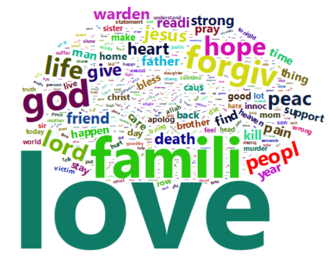
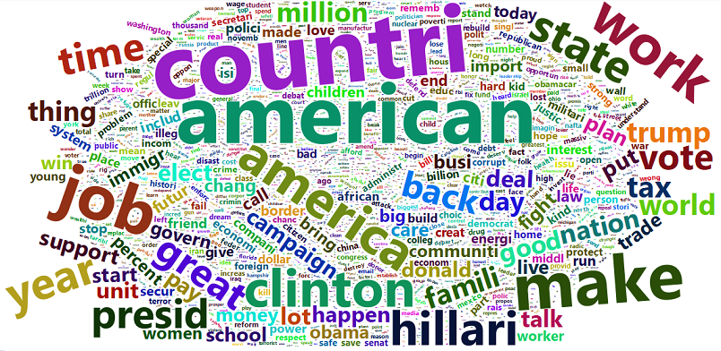

```{r setup, include=FALSE}
knitr::opts_chunk$set(echo = FALSE)
```

## Topic models via _topicmodels_

Topic models are a useful tool for the statistical analysis of texts.

Illustrate the usage of topic models  via the package "topicmodels".

Apply the methodology dataset "Last Words of Death Row Inmates" and "2016 U.S. Presidential Campaign Texts and Polls".

## Topic models

Topic modeling aims to discover and annotate large archives of documents with thematic information.

There are different models, in the _topicmodels_ package there are:

 - Latent Dirichlet Allocation
    + Variational Expectation Maximization and Gibbs sampling
 - Correlated Topic Models
    + Variational Expectation Maximization

## Dataset Last Words of Death Row Inmates (I)

This dataset includes information on criminals executed by Texas Department of Criminal Justice from 1982 to November 8th, 2017.

545 observations with 21 variables: 

 - Execution: The order of execution, numeric. 
 - LastName: Last name of the offender, character. 
 - FirstName: First name of the offender, character. 
 - TDCJNumber: TDCJ Number of the offender, numeric. 
 - Age: Age of the offender, numeric. 
 - Race: Race of the offender, categorical : Black, Hispanic, White, Other. 
 - CountyOfConviction: County of conviction, character. 
 - AgeWhenReceived: Age of offender when received, numeric. 
 - EducationLevel: Education level of offender, numeric. 
 - Native County: Native county of offender, categorical : 0 = Within Texas, 1= Outside Texas. 
 - PreviousCrime : Whether the offender committed any crime before, categorical: 0= No, 1= Yes. 
 - Codefendants: Number of co-defendants, numeric. 
 - NumberVictim: Number of victims, numeric. 
 - WhiteVictim, HispanicVictim, BlackVictim, VictimOtherRace. FemaleVictim, MaleVictim: Number of victims with specified demographic features, numeric. 
 - LastStatement: Last statement of offender, character.

## Dataset Last Words of Death Row Inmates (II)
```{r}
set.seed(1234)
library(topicmodels,warn.conflicts = FALSE, quietly=TRUE)
library(readr,warn.conflicts = FALSE, quietly=TRUE)
library(tm,warn.conflicts = FALSE, quietly=TRUE)
#suppressMessages(library(tidyverse,warn.conflicts = FALSE, quietly=TRUE))
library(dplyr,warn.conflicts = FALSE, quietly=TRUE)
library(tidytext,warn.conflicts = FALSE, quietly=TRUE)
library(slam,warn.conflicts = FALSE, quietly=TRUE)
library(ggplot2,warn.conflicts = FALSE, quietly=TRUE)
library(plotly,warn.conflicts = FALSE, quietly=TRUE)
library(DT,warn.conflicts = FALSE, quietly=TRUE)

## load documents
# read document of last statement
suppressMessages(data<-read_csv("Texas Last Statement - CSV.csv"))
good_indexes <- data$LastStatement != "None"

# column TDCJNumber can be used as indentifier for each observation
# column LastStatement has the text of the last statement

# there are some problems with some characters, let's convert to ascii
data$LastStatement <- iconv(data$LastStatement, from = "UTF-8", to = "ASCII//TRANSLIT")


docs_statement <- data %>% filter(LastStatement != "None") %>% mutate(doc_id=as.character(TDCJNumber),text=LastStatement)
docs<-docs_statement

## read documents of elections
folders<-c("debates","primaries","speeches")
docs_election<-data.frame(doc_id=character(),text=character(),folder=character(),who=character())
for(folder in folders){
  file_list <- list.files(folder)
  for (file in file_list){
    fileName<-paste(folder,file,sep="/")
    text<-read_file(fileName)
    docs_election<-rbind(docs_election,data.frame(doc_id=fileName,text=text,folder=folder,who=tolower(substr(file,0,5)),stringsAsFactors = F))
  }
}
docs_election<-docs_election %>% mutate(folder=factor(folder),who=factor(who))

datatable(
  docs_statement %>% select(-one_of("doc_id","text","LastStatement")), extensions = 'FixedColumns',
  options = list(
  scrollX = T,
  scrollCollapse = T,paging=T,searching=T
))
```

## Last statements

```{r}
datatable(
  docs_statement %>% select("LastStatement"), extensions = 'FixedColumns',
  options = list(
  scrollX = T,
  scrollCollapse = T,paging=T,searching=T,pageLength=3
))
```

## Most used words in last statements


```{r}
library(wordcloud2)
### 
 # function to get document term matrix
 # documents: dataframe with columns doc_id and text
 # tfidf_threshold: (optional, default 0) minimum tf-idf value for each word to be kept in the dtm vocabulary
getDtm <- function(documents, tfidf_threshold=0){
  ds  <- DataframeSource(data.frame(doc_id = documents$doc_id,
                                    text = documents$text,
                                    stringsAsFactors = FALSE))
  x   <- SimpleCorpus(ds)
  # to lower, remove stopwords, remove numbers and punctuation, use stemming
  x   <- tm_map(x, content_transformer(tolower))
  # x   <- tm_map(x, removePunctuation)
  x   <- tm_map(x, removeWords, c(stopwords("SMART")))
  dtm <- DocumentTermMatrix(x, control = list(minWordLength = 3, removeNumbers = TRUE, removePunctuation = TRUE, stemming = TRUE))

  # reduce vocabulary of the dtm, consider only words with high values of tf-idf
  term_tfidf<-tapply(dtm$v/row_sums(dtm)[dtm$i], dtm$j, mean) *log2(nDocs(dtm)/col_sums(dtm > 0))
  #print(paste("median tf-idf:",median(term_tfidf)))

  dtm_reduced <- dtm[, term_tfidf >= tfidf_threshold]
  rowTotals <- apply(dtm_reduced , 1, sum) #Find the sum of words in each Document
  dtm_reduced   <- dtm[rowTotals> 0, ]           #remove all docs without words
  return(dtm_reduced)
}

###
 # function to get mean value of entropy for document_topics distribution
 # ap_lda: lda topic model
 # dtm: document term matrix
evaluate_doc_topics_distribution<-function(ap_lda, dtm){
  # get for each document the topic distribution
  doc_topics_distribution<-posterior(ap_lda,dtm)$topics
  # compute for each document the entropy of the topic distribution:
  #  documents with only 1 topic with very high probability will have small value of entropy
  #  documents with many topics with same probability (almost uniform distribution) will have high value of entropy
  doc_topics_distribution$entropy<- -rowSums(doc_topics_distribution*log2(doc_topics_distribution))
  doc_topics_entropy<-mean(doc_topics_distribution$entropy)
  return(doc_topics_entropy)
}

dtm.new<- getDtm(docs,tfidf_threshold = 0)

words<-data.frame(word=colnames(dtm.new),count=apply(dtm.new,2,sum),stringsAsFactors = F) %>% filter(count>4)
#wordcloud2::wordcloud2(words)

```



## LDA using VEM

```{r}
ap_lda <- LDA(dtm.new, k = 5, control = list(seed = 1234,keep=1))
ap_topics <- tidy(ap_lda, matrix = "beta")


ap_top_terms <- ap_topics %>%
  group_by(topic) %>%
  top_n(10, beta) %>%
  ungroup() %>%
  arrange(topic, -beta)

ap_top_terms %>%
  mutate(term = reorder(term, beta)) %>%
  ggplot(aes(term, beta, fill = factor(topic))) +
  geom_col(show.legend = FALSE) +
  facet_wrap(~ topic, scales = "free") +
  coord_flip()+
  labs(title="Top words of each topic")
```

## Top relevant Words for each topic


$$relevance = \lambda*p(word|topic)+(1-\lambda)*\frac{p(word|topic)}{p(word)}$$

```{r}
# Highlight words that are really relevant for each topic, so discard common words varying

total<-sum(words$count)
lambda<-0.9 # choose proper value of lambda
ap_top_terms <- ap_topics %>% inner_join(words,by=c("term"="word"))%>% mutate(freq=count/total,relevance=lambda*beta+(1-lambda)*beta/freq) %>% 
  group_by(topic) %>%
  top_n(10, relevance) %>%
  ungroup() %>%
  arrange(topic, -relevance)

ap_top_terms %>%
  mutate(term = reorder(term, relevance)) %>%
  ggplot(aes(term, relevance, fill = factor(topic))) +
  geom_col(show.legend = FALSE) +
  facet_wrap(~ topic, scales = "free") +
  coord_flip()+
  labs(title="Top relevant words of each topic")

```

## Distribution of topics

```{r}
ap_documents <- tidy(ap_lda, matrix = "gamma")


dd<-docs %>% inner_join(ap_documents,by=c("doc_id"="document"))

# distribution of topics
dd %>% group_by(topic) %>% summarise(gamma=sum(gamma)) %>% 
  ggplot(aes(x=factor(topic),y=gamma))+geom_col()+labs(x="topic")
```

## Distribution of topics considering age of the author (I)

```{r}
# plot distribution of documents w.r.t a feature (column groupByValue)
data_by_groups<-function(data){
  a<-data%>% group_by(groupByValue) %>% summarise(count=n()) 
  p<-ggplot(a,aes(x=groupByValue,y=count))+geom_col()
  return(list(plot=p,data=a))
}
# plot distribution of topics w.r.t documents feature (column groupByValue)
topic_by_groups<-function(data,total){
  p<-data %>% group_by(groupByValue,topic) %>% summarise(gamma=sum(gamma)) %>% inner_join(total,by="groupByValue") %>% mutate(gamma=gamma/count) %>% 
    ggplot(aes(x=groupByValue,y=gamma,color=factor(topic)))+geom_point()+geom_smooth(se=F,method="loess")
  return(p)
}

# group data by age and plot distribution
dataByGroup<-dd %>% mutate(groupByValue=floor(Age/10)*10)
t<-data_by_groups(dataByGroup)
t$plot+labs(x="Age")
```


## Distribution of topics considering age of the author (II)

```{r}
p<-topic_by_groups(dataByGroup,t$data)+labs(x="Age",color="topic")
suppressWarnings(print(p))
```

## Distribution of topics considering number of victims (I)

```{r}
# group data by MaleVictim and plot distribution
dataByGroup<-dd %>% mutate(groupByValue=NumberVictim)
t<-data_by_groups(dataByGroup)
p<-t$plot+labs(x="Victims")
suppressWarnings(print(p))
```


## Distribution of topics considering number of victims (II)

```{r}
p<-topic_by_groups(dataByGroup,t$data)+labs(x="Victims",color="topic")
suppressWarnings(print(p))
```


## Dataset 2016 U.S. Presidential Campaign Texts and Polls

It is a collection of transcripts that contains:

 - the presidential debates of Trump and Clinton
 - Trump's speeches delivered after the RNC and Clinton's speeches delivered after the DNC
 - speeches delivered by Trump, Clinton and Sanders during the primary campaigns

## 2016 U.S. Presidential Campaign Texts

```{r}
datatable(
  docs_election %>% select(text) %>% head, extensions = 'FixedColumns',
  options = list(
  scrollX = T,
  scrollCollapse = T,paging=T,searching=T,pageLength=3
))
```

## Most used words in election documents 

```{r}
docs<-docs_election
dtm.new<- getDtm(docs,tfidf_threshold = 0)

words<-data.frame(word=colnames(dtm.new),count=apply(dtm.new,2,sum),stringsAsFactors = F) %>% filter(count>4)
#wordcloud2::wordcloud2(words)

```



## LDA using VEM

```{r}
ap_lda <- LDA(dtm.new, k = 5, control = list(seed = 1234,keep=1))
ap_topics <- tidy(ap_lda, matrix = "beta")


ap_top_terms <- ap_topics %>%
  group_by(topic) %>%
  top_n(10, beta) %>%
  ungroup() %>%
  arrange(topic, -beta)

ap_top_terms %>%
  mutate(term = reorder(term, beta)) %>%
  ggplot(aes(term, beta, fill = factor(topic))) +
  geom_col(show.legend = FALSE) +
  facet_wrap(~ topic, scales = "free") +
  coord_flip()+
  labs(title="Top words of each topic")
```

## Top relevant Words for each topic


$$relevance = \lambda*p(word|topic)+(1-\lambda)*\frac{p(word|topic)}{p(word)}$$

```{r}
# Highlight words that are really relevant for each topic, so discard common words varying

total<-sum(words$count)
lambda<-0.9 # choose proper value of lambda
ap_top_terms <- ap_topics %>% inner_join(words,by=c("term"="word"))%>% mutate(freq=count/total,relevance=lambda*beta+(1-lambda)*beta/freq) %>% 
  group_by(topic) %>%
  top_n(10, relevance) %>%
  ungroup() %>%
  arrange(topic, -relevance)

ap_top_terms %>%
  mutate(term = reorder(term, relevance)) %>%
  ggplot(aes(term, relevance, fill = factor(topic))) +
  geom_col(show.legend = FALSE) +
  facet_wrap(~ topic, scales = "free") +
  coord_flip()+
  labs(title="Top relevant words of each topic")

```

## Distribution of topics

```{r}
ap_documents <- tidy(ap_lda, matrix = "gamma")


dd<-docs %>% inner_join(ap_documents,by=c("doc_id"="document"))

# distribution of topics
dd %>% group_by(topic) %>% summarise(gamma=sum(gamma)) %>% 
  ggplot(aes(x=factor(topic),y=gamma))+geom_col()+labs(x="topic")
```

## Distribution of topics considering type of text (I)

```{r}
# group data by folder and plot distribution
dataByGroup<-dd %>% mutate(groupByValue=folder)
t<-data_by_groups(dataByGroup)
t$plot+labs(x="Type")
```

## Distribution of topics considering type of text (II)

```{r}
topic_by_groups(dataByGroup,t$data)+labs(x="Type",color="topic")
```


## Distribution of topics considering the author (I)

```{r}
# group data by who and plot distribution
dataByGroup<-dd %>% mutate(groupByValue=who)
t<-data_by_groups(dataByGroup)
t$plot+labs(x="Who")
```

## Distribution of topics considering the author (II)


```{r}
topic_by_groups(dataByGroup,t$data)+labs(x="Who",color="topic")
```

## Number of topics

To build the model you need to choose the number of topics.

Cross validation can be used to evaluate models based on different nummber of topics.

Two indexes are considered: perplexity and entropy.

## Number of topics cross validation results

```{r}
library(tidyr,warn.conflicts = FALSE, quietly=TRUE)
df<-read.csv("matrix_cross_validation.csv")
colnames(df)<-c("rownumber","fold","topics","perplexity_train","entropy_train","perplexity_test","entropy_test")
df<-df %>% mutate(entropy_train=entropy_train/log(topics),entropy_test=entropy_test/log(topics))

df<-df %>% gather(measure,value,perplexity_train,entropy_train,perplexity_test, entropy_test)
ggplot(df,aes(x=factor(topics),y=value,color=factor(fold)))+
  geom_point()+
  geom_line(aes(group=fold))+
  geom_point(data=df %>% group_by(topics,measure) %>% mutate(value=mean(value)),aes(x=factor(topics),y=value),color="red")+
  facet_wrap(~measure,scales = "free")
```

## Compare VEM and Gibbs methods (I)

Estimate of LDA model can be made using VEM algorithm or Gibbs sampling.

TODo add descr

## Compare VEM and Gibbs methods (II)

```{r}
ap_lda <- LDA(dtm.new, k = 5, control = list(seed = 1234,keep=1))
#plot(ap_lda@logLiks)
ap_lda <- LDA(dtm.new, k = 5, method = "Gibbs", control = list(burnin = 200, iter = 1000, keep = 1) )
# check convergence of chain looking at loglikelihood vs iterations
plot(ap_lda@logLiks)
```
