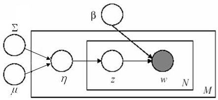

```{r setup, include=FALSE}
knitr::opts_chunk$set(echo = FALSE)
# knitr::opts_chunk$set(cache = TRUE)
```

## Topic models via _topicmodels_

Topic models are a useful tool for the statistical analysis of texts.

Illustrate the usage of topic models  via the package "topicmodels".

Apply the methodology dataset "Last Words of Death Row Inmates" and "2016 U.S. Presidential Campaign Texts and Polls".

## Topic models

Topic modeling aims to discover and annotate large archives of documents with thematic information.

There are different models, in the _topicmodels_ package there are:

 - Latent Dirichlet Allocation
    + Variational Expectation Maximization and Gibbs sampling
 - Correlated Topic Models
    + Variational Expectation Maximization

## Latent Dirichlet Allocation models (I)

LDA is a Bayesian Mixture Model which can be applied to the analysis of a corpus of documents.

LDA models each topic as a discrete distribution over a finite set of words, and each document as a finite distribution over the set of the $K$ topics.

There is a generative model assumed, for which each document "chooses" a probability distribution over the set of all topics, and each time a word is drawn, first a topic is randomly chosen, then a word is drawn randomly from its associated distribution.

## Latent Dirichlet Allocation models (II)

Given $\alpha$ and $\beta$ parameters for the Dirichlet priors, LDA assumes therefore the following generative process:

 - draw $\theta_m$ and $\phi_k$, respectively the topics and words distributions, from $\mbox{Dir}(\alpha)$ and $\mbox{Dir}(\beta)$
 - the topics $z_{mn}$ are drawn from the categ. distributions $\theta_m$
 - the words $w_{mn}$ are drawn from the categ. distributions $\phi_{z_{mn}}$

LDA can be represented as a Probabilistic Graphical Model:

<center>

</center>

## Data cleaning and lemmatization

Often overlooked aspects; apart from the purely "programming-related" problems, some design decisions heavily affect the end results.

In this case, the stopwords set (set of words to be discarded during reading) and the stemming algorithm (that removes suffixes from words) can introduce noise or (in some sense) bias, unless carefully chosen.

## Dataset Last Words of Death Row Inmates (I)

This dataset includes information on criminals executed by Texas Department of Criminal Justice from 1982 to November 8th, 2017.

545 observations with 21 variables:

 - Execution: The order of execution, numeric. 
 - LastName: Last name of the offender, character. 
 - FirstName: First name of the offender, character. 
 - TDCJNumber: TDCJ Number of the offender, numeric. 
 - Age: Age of the offender, numeric. 
 - Race: Race of the offender, categorical : Black, Hispanic, White, Other. 
 - CountyOfConviction: County of conviction, character. 
 - AgeWhenReceived: Age of offender when received, numeric. 
 - EducationLevel: Education level of offender, numeric. 
 - Native County: Native county of offender, categorical : 0 = Within Texas, 1= Outside Texas. 
 - PreviousCrime : Whether the offender committed any crime before, categorical: 0= No, 1= Yes. 
 - Codefendants: Number of co-defendants, numeric. 
 - NumberVictim: Number of victims, numeric. 
 - WhiteVictim, HispanicVictim, BlackVictim, VictimOtherRace. FemaleVictim, MaleVictim: Number of victims with specified demographic features, numeric. 
 - LastStatement: Last statement of offender, character.

## Dataset Last Words of Death Row Inmates (II)
```{r message=FALSE, warning=FALSE, include=FALSE}
set.seed(1234)
library(topicmodels,warn.conflicts = FALSE, quietly=TRUE)
library(readr,warn.conflicts = FALSE, quietly=TRUE)
library(tm,warn.conflicts = FALSE, quietly=TRUE)
#suppressMessages(library(tidyverse,warn.conflicts = FALSE, quietly=TRUE))
library(dplyr,warn.conflicts = FALSE, quietly=TRUE)
library(tidytext,warn.conflicts = FALSE, quietly=TRUE)
library(tidyverse,warn.conflicts = FALSE, quietly=TRUE)
library(slam,warn.conflicts = FALSE, quietly=TRUE)
library(ggplot2,warn.conflicts = FALSE, quietly=TRUE)
library(plotly,warn.conflicts = FALSE, quietly=TRUE)
library(DT,warn.conflicts = FALSE, quietly=TRUE)
library(LDAvis,warn.conflicts = FALSE, quietly=TRUE)
library(modeltools,warn.conflicts = FALSE, quietly=TRUE)
source('lda_tidiers.R')
```

```{r}
doc_name = as.name('docs_statement')

## load documents
# read document of last statement
suppressMessages(data_tls<-read_csv("Texas Last Statement - CSV.csv"))
stopwords_sieved <- readLines('stopwords.dat')

# column TDCJNumber can be used as indentifier for each observation
# column LastStatement has the text of the last statement

# there are some problems with some characters, let's convert to ascii
data_tls$LastStatement <- iconv(data_tls$LastStatement, from = "UTF-8", to = "ASCII//TRANSLIT")

# remove entries with no statement, rename variables
docs_statement <- data_tls %>% filter(LastStatement != "None") %>% rename(doc_id=TDCJNumber, text=LastStatement) %>% mutate(doc_id=as.character(doc_id))

## read documents of elections
folders<-c("debates","primaries","speeches")
docs_election<-data.frame(doc_id=character(),text=character(),folder=character(),who=character())
for(folder in folders){
  file_list <- list.files(folder)
  for (file in file_list){
    fileName<-paste(folder,file,sep="/")
    text<-read_file(fileName)
    docs_election<-rbind(docs_election,data.frame(doc_id=fileName,text=text,folder=folder,who=tolower(substr(file,0,5)),stringsAsFactors = F))
  }
}
docs_election <- docs_election %>% mutate(folder=factor(folder),who=factor(who))

datatable(
  docs_statement %>% select(-one_of("doc_id","text")), extensions = 'FixedColumns',
  options = list(
  scrollX = T,
  scrollCollapse = T,paging=T,searching=T
))
```

## Last statements

```{r}
datatable(
  docs_statement %>% select("Last Statement" = "text"), extensions = 'FixedColumns',
  options = list(
  scrollX = T,
  scrollCollapse = T,paging=T,searching=T,pageLength=3
))
```

## Most used words in last statements

```{r}
library(wordcloud2)
### 
 # function to get document term matrix
 # documents: dataframe with columns doc_id and text
 # tfidf_threshold: (optional, default 0) minimum tf-idf value for each word to be kept in the dtm vocabulary
getDtm <- function(documents, tfidf_threshold=0, stopwords_vector = stopwords('SMART')){
  ds  <- DataframeSource(data.frame(doc_id = documents$doc_id,
                                    text = documents$text,
                                    stringsAsFactors = FALSE))
  x   <- SimpleCorpus(ds)
  # to lower, remove stopwords, remove numbers and punctuation, use stemming
  x   <- tm_map(x, content_transformer(tolower))
  # x   <- tm_map(x, removePunctuation)
  x   <- tm_map(x, removeWords, stopwords_vector)
  dtm <- DocumentTermMatrix(x, control = list(minWordLength = 3, removeNumbers = TRUE, removePunctuation = TRUE, stemming = TRUE))

  # reduce vocabulary of the dtm, consider only words with high values of tf-idf
  term_tfidf<-tapply(dtm$v/row_sums(dtm)[dtm$i], dtm$j, mean) *log2(nDocs(dtm)/col_sums(dtm > 0))

  dtm_reduced <- dtm[, term_tfidf >= tfidf_threshold]
  rowTotals <- apply(dtm_reduced , 1, sum) #Find the sum of words in each Document
  dtm_reduced   <- dtm[rowTotals> 0, ]           #remove all docs without words
  return(dtm_reduced)
}

###
 # function to get mean value of entropy for document_topics distribution
 # ap_lda: lda topic model
 # dtm: document term matrix
evaluate_doc_topics_distribution<-function(ap_lda, dtm){
  # get for each document the topic distribution
  doc_topics_distribution<-posterior(ap_lda,dtm)$topics
  # compute for each document the entropy of the topic distribution:
  #  documents with only 1 topic with very high probability will have small value of entropy
  #  documents with many topics with same probability (almost uniform distribution) will have high value of entropy
  doc_topics_distribution$entropy<- -rowSums(doc_topics_distribution*log2(doc_topics_distribution))
  doc_topics_entropy<-mean(doc_topics_distribution$entropy)
  return(doc_topics_entropy)
}

docs <- eval(doc_name)
dtm.new<- getDtm(docs,tfidf_threshold = 0, stopwords_vector = stopwords_sieved)

words<-data.frame(word=colnames(dtm.new),count=apply(dtm.new,2,sum),stringsAsFactors = F) %>% filter(count>4)
#wordcloud2::wordcloud2(words)

```


## LDA using VEM

```{r}
ap_lda <- LDA(dtm.new, k = 5, control = list(seed = 1234,keep=1))
ap_lda_LS <- ap_lda
ap_topics <- tidy(ap_lda, matrix = "beta")

plot.ap_top_terms <- function(ap_topics) {
  ap_top_terms <- ap_topics %>%
    group_by(topic) %>%
    top_n(10, beta) %>%
    ungroup() %>%
    arrange(topic, -beta)
  
  ap_top_terms %>%
    mutate(term = reorder(term, beta)) %>%
    ggplot(aes(term, beta, fill = factor(topic))) +
    geom_col(show.legend = FALSE) +
    facet_wrap(~ topic, scales = "free") +
    coord_flip()+
    labs(title="Top words for each topic")
}
plot.ap_top_terms(ap_topics)
```

## Top relevant Words for each topic


$$relevance = \lambda*\log p(word|topic)+(1-\lambda)*\log\,\frac{p(word|topic)}{p(word)}$$

```{r}
# Highlight words that are really relevant for each topic, so discard common words varying

lambda <- 0.6
plot.ap_relevant_terms <- function(ap_topics) {
  ap_rel_terms <- ap_topics %>%
    # mutate(topic = paste0("topic", topic)) %>%
    spread(topic, beta)
  globalProb = rowSums(ap_rel_terms[-1]) / (ncol(ap_rel_terms)-1)
  ap_rel_terms[-1] <- log(ap_rel_terms[-1]) + (lambda - 1) * log(globalProb)
  
  ap_rel_terms %>%
    gather(topic, relevance, -term) %>% 
    group_by(topic) %>% 
    top_n(10, relevance) %>%
    ggplot(aes(term, relevance, fill = factor(topic))) +
    geom_col(show.legend = FALSE) +
    facet_wrap(~ topic, scales = "free") +
    coord_flip() +
    labs(title="High-relevance words in topics")
}
plot.ap_relevant_terms(ap_topics)

```

## Distribution of topics

```{r}
ap_documents <- tidy(ap_lda, matrix = "gamma")


dd<-docs %>% inner_join(ap_documents,by=c("doc_id"="document"))

# distribution of topics
dd %>% group_by(topic) %>% summarise(gamma=sum(gamma)) %>% 
  ggplot(aes(x=factor(topic),y=gamma))+geom_col()+labs(x="topic")
```

## Distribution of topics considering age of the author (I)

```{r}
# plot distribution of documents w.r.t a feature (column groupByValue)
data_by_groups<-function(data){
  a<-data%>% group_by(groupByValue) %>% summarise(count=n()) 
  p<-ggplot(a,aes(x=groupByValue,y=count))+geom_col()
  return(list(plot=p,data=a))
}
# plot distribution of topics w.r.t documents feature (column groupByValue)
topic_by_groups<-function(data,total){
  p<-data %>% group_by(groupByValue,topic) %>% summarise(gamma=sum(gamma)) %>% inner_join(total,by="groupByValue") %>% mutate(gamma=gamma/count) %>% 
    ggplot(aes(x=groupByValue,y=gamma,color=factor(topic)))+geom_point()+geom_smooth(se=F,method="loess")
  return(p)
}

# group data by age and plot distribution
dataByGroup<-dd %>% mutate(groupByValue=floor(Age/10)*10)
t<-data_by_groups(dataByGroup)
t$plot+labs(x="Age")
```


## Distribution of topics considering age of the author (II)

```{r}
p<-topic_by_groups(dataByGroup,t$data)+labs(x="Age",color="topic")
suppressWarnings(print(p))
```

## Distribution of topics considering number of victims (I)

```{r}
# group data by MaleVictim and plot distribution
dataByGroup<-dd %>% mutate(groupByValue=NumberVictim)
t<-data_by_groups(dataByGroup)
p<-t$plot+labs(x="Victims")
suppressWarnings(print(p))
```


## Distribution of topics considering number of victims (II)

```{r}
p<-topic_by_groups(dataByGroup,t$data)+labs(x="Victims",color="topic")
suppressWarnings(print(p))
```

## Dataset 2016 U.S. Presidential Campaign Texts and Polls

It is a collection of transcripts that contains:

 - the presidential debates of Trump and Clinton
 - Trump's speeches delivered after the RNC and Clinton's speeches delivered after the DNC
 - speeches delivered by Trump, Clinton and Sanders during the primary campaigns

## 2016 U.S. Presidential Campaign Texts

```{r}
datatable(
  docs_election %>% select(text) %>% head, extensions = 'FixedColumns',
  options = list(
  scrollX = T,
  scrollCollapse = T,paging=T,searching=T,pageLength=3
))
```

## Most used words in election documents 

```{r}
docs<-docs_election
dtm.new<- getDtm(docs,tfidf_threshold = 0)

words<-data.frame(word=colnames(dtm.new),count=apply(dtm.new,2,sum),stringsAsFactors = F) %>% filter(count>4)
#wordcloud2::wordcloud2(words)

```


## LDA using VEM

```{r}
ap_lda <- LDA(dtm.new, k = 5, control = list(seed = 1234,keep=1))
ap_topics <- tidy(ap_lda, matrix = "beta")

plot.ap_top_terms(ap_topics)
```

## Top relevant Words for each topic


$$relevance = \lambda*\log p(word|topic)+(1-\lambda)*\log\,\frac{p(word|topic)}{p(word)}$$

```{r}
# Highlight words that are really relevant for each topic, so discard common words varying
plot.ap_relevant_terms(ap_topics)
```

## Distribution of topics

```{r}
ap_documents <- tidy(ap_lda, matrix = "gamma")


dd<-docs %>% inner_join(ap_documents,by=c("doc_id"="document"))

# distribution of topics
dd %>% group_by(topic) %>% summarise(gamma=sum(gamma)) %>% 
  ggplot(aes(x=factor(topic),y=gamma))+geom_col()+labs(x="topic")
```

## Distribution of topics considering type of text (I)

```{r}
# group data by folder and plot distribution
dataByGroup<-dd %>% mutate(groupByValue=folder)
t<-data_by_groups(dataByGroup)
t$plot+labs(x="Type")
```

## Distribution of topics considering type of text (II)

```{r}
topic_by_groups(dataByGroup,t$data)+labs(x="Type",color="topic")
```


## Distribution of topics considering the author (I)

```{r}
# group data by who and plot distribution
dataByGroup<-dd %>% mutate(groupByValue=who)
t<-data_by_groups(dataByGroup)
t$plot+labs(x="Who")
```

## Distribution of topics considering the author (II)


```{r}
topic_by_groups(dataByGroup,t$data)+labs(x="Who",color="topic")
```

## Number of topics

To build the model you need to choose the number of topics.

Cross validation can be used to evaluate models based on different nummber of topics.

Two indexes are considered: perplexity and entropy.

## Number of topics cross validation results

```{r}
library(tidyr,warn.conflicts = FALSE, quietly=TRUE)
df<-read.csv("matrix_cross_validation.csv")
colnames(df)<-c("rownumber","fold","topics","perplexity_train","entropy_train","perplexity_test","entropy_test")
df<-df %>% mutate(entropy_train=entropy_train/log(topics),entropy_test=entropy_test/log(topics))

df<-df %>% gather(measure,value,perplexity_train,entropy_train,perplexity_test, entropy_test)
ggplot(df,aes(x=factor(topics),y=value,color=factor(fold)))+
  geom_point()+
  geom_line(aes(group=fold))+
  geom_point(data=df %>% group_by(topics,measure) %>% mutate(value=mean(value)),aes(x=factor(topics),y=value),color="red")+
  facet_wrap(~measure,scales = "free")
```

## Correlated Topic Models (I)

While LDA performs decently under opportune conditions, it fails to model the correlation between topics (or rather, it assumes a-priori uncorrelation between them).

One way to approach this problem is to modify our model to replace the Dirichlet distribution on the topics with a logistic normal distribution with mean $\mu$ and correlation matrix $\Sigma$, obtaining the following PGM schema:

<center>

</center>

## Correlated Topic Models (II)

The resulting model can be estimated by VEM, but no analogous to the Gibbs sampling method currently exists for CTM.

```{r message=FALSE, warning=FALSE, include=FALSE, cache=TRUE}
ap_ctm <- CTM(dtm.new, k = 5, control = list(seed=1234,keep=1))
```

```{r fig.height=4.5, fig.width=7, fig.align='center'}
ap_ctm_topics <- tidy(ap_ctm, matrix = "beta")
plot.ap_top_terms(ap_ctm_topics)
```

## Correlated Topic Models (III)

Due to the significant increase in the number of parameters in the prior distribution, the convergence of the algorithm is much slower. This performance tradeoff is often unfeasible (often 10x slower than regular LDA) and/or numerically unstable.

```{r fig.height=4, fig.width=6, fig.align='center'}
plot.ap_relevant_terms(ap_ctm_topics)
```


## Principal Component Analysis
Alternative ways to obtain from LDA a measure of affinity between different topics have been designed.

One such method, useful for data visualization, is based on PCA. Given each topic's distribution, we can compute the Jensen-Shannon divergence between each pair, obtaining a $K\times K$ matrix; afterwards, we use classical multidimensional reduction on the obtained matrix to reduce the number of dimensions to 2 (typically).
This way we associate to each topic a point in $\mathbb{R}^2$.

```{r fig.height=2, fig.width=3, fig.align='center', cache=F}
PCA <- LDAvis::jsPCA(posterior(ap_lda_LS)$terms)
par(mar=c(0.5,0.5,0.4,0.1))
symbols(PCA, circles = sqrt(colMeans(ap_lda_LS@gamma)/60) , inches = FALSE)
text(PCA, col=2)
```
